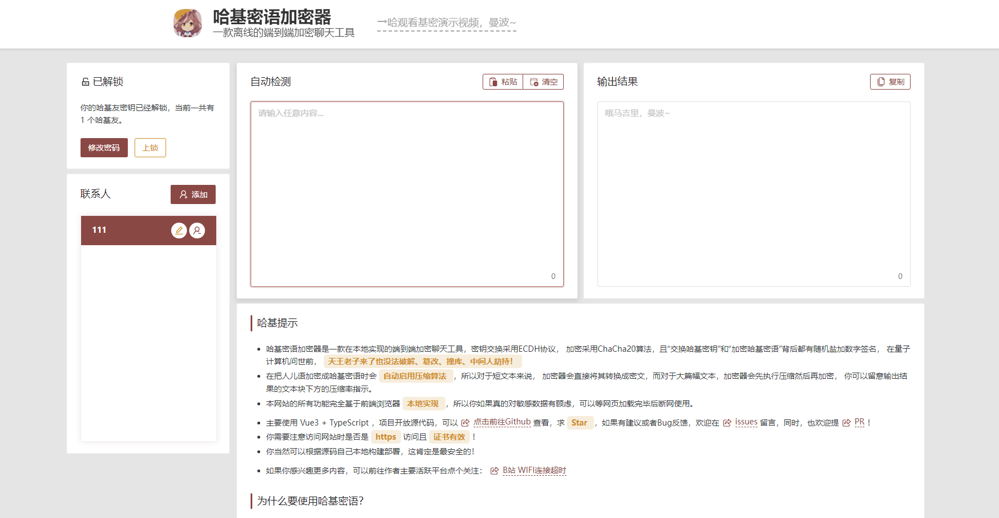

# translate-ha-jimi

HaJimi Cipher v2.0

### Author's Note on 2025.8.16:

HaJimi Cipher Next version (v3.0) is currently under active development...

Visit the [dev-next](https://github.com/wifi504/translate-ha-jimi/tree/dev-next) branch to monitor the progress!

Suggestions are welcome!

---

> **Important Notice**
>
> - HaJimi Cipher is designed for entertainment purposes and serves as a learning tool for program design and algorithm implementation.
>
> - This program is based on existing open-source encryption technologies and only provides encryption algorithm functionality. It does not save user communication content or participate in user communication behavior.

### Introduction

- HaJimi Cipher is an end-to-end encrypted chat tool implemented locally. It uses the ECDH protocol for key exchange and the ChaCha20 algorithm for encryption. Both "exchanging HaJimi keys" and "encrypting HaJimi ciphertext" are backed by random salt and digital signatures. Before the advent of quantum computers, **no one can crack, tamper with, brute force, or perform man-in-the-middle attacks!**
- When encrypting plaintext into HaJimi ciphertext, **compression algorithms are automatically enabled**. For short texts, the encryptor will directly convert them to ciphertext, while for large texts, the encryptor will compress first and then encrypt. You can check the compression ratio indicator below the output text block.
- All features of this website are fully implemented **locally in the frontend browser**, so if you have concerns about sensitive data, you can disconnect from the network after the webpage loads and use it offline.



### Usage

- Open [HaJimi Cipher](https://lhlnb.top/hajimi) on your device to experience it online

- If you want to deploy the project locally, the simplest way is to follow these steps:

  1. Download the entire project repository to your local machine and ensure you have a `Node.js` environment installed, along with package managers like `pnpm`

  2. Run the following commands in the project directory:

     ```bash
     pnpm install
     ```

     ```bash
     pnpm run build
     ```

  3. Mount the output static resource files (in the `./dist/` directory) using a web container, or you can directly run the following command to start locally:

     ```bash
     pnpm run preview
     ```

  You can now use it in your local environment

### Tech Stack

Vue3 | TypeScript | Vite

### Stars

[](https://www.star-history.com/#wifi504/translate-ha-jimi&Date)
