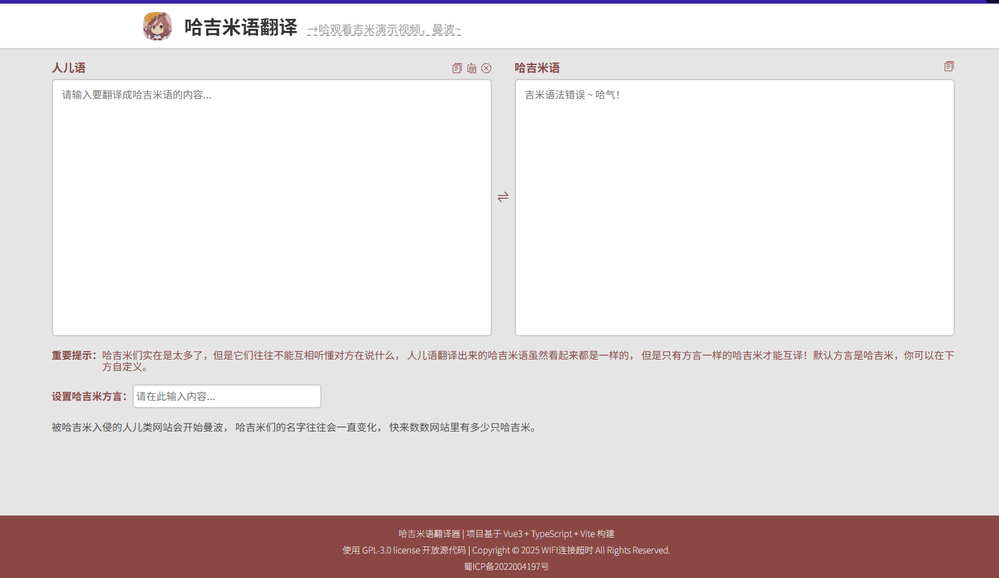

### v2.0 版本正在开发中...

解决评论区有人认为当前的“哈基密语”不够密的问题，策马加鞭coding中.....

------

# translate-ha-jimi

哈吉米语翻译器

### 简介

哈吉米翻译器是一款人儿语哈吉米语互翻的在线工具。快速转换文字，体验另类语言编码的乐趣。

### 使用

- 使用电脑或手机打开 [哈吉米语翻译器](https://lhlnb.top/hajimi) ，点击切换图片或按钮可以切换翻译模式，输入翻译内容即可实现人儿语和哈吉米语相互转换。
- 可以设置密钥（哈吉米方言）来实现翻译时加密，只有拥有密钥的人才能把加密的哈吉米话还原回来。
- 彩蛋：哦马吉里网站已经被哈吉米入侵，曼波~

### 技术栈

Vue3 | TypeScript | Vite

### 开源协议

GNU General Public License v3.0
